# MarkyStudio — System Architecture

> AI-powered code-to-video pipeline. User prompt + screenshots → planned narrative → LLM-generated React/Remotion components → live preview → rendered MP4.

---

## 1. High-Level Pipeline

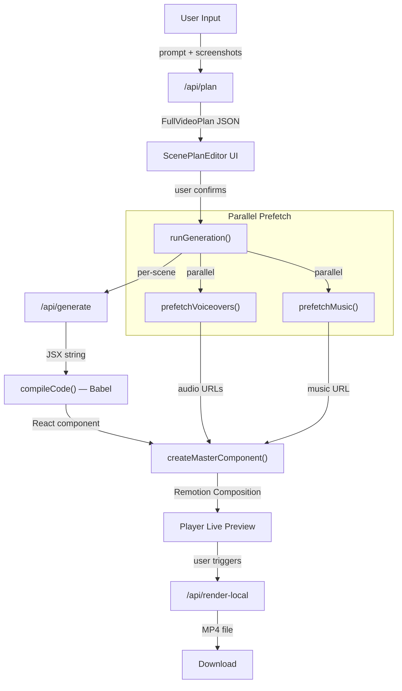

---

## 2. Technology Stack

| Layer | Technology | Version |
|---|---|---|
| Framework | Next.js (App Router) | 16.1.5 |
| Language | TypeScript | 5.9.3 |
| Video Runtime | Remotion | 4.0.428 |
| 3D | @remotion/three + Three.js + @react-three/fiber | 4.0.428 / 0.178.0 / 9.1.0 |
| LLM | Google Gemini via @google/genai | 1.43.0 |
| Compilation | @babel/standalone (in-browser) | 7.28.5 |
| TTS | ElevenLabs API | via /api/tts |
| Image Processing | sharp | ^0.34.5 |
| Resolution | 1920×1080 @ 30fps | — |

---

## 3. File Architecture

```
src/
├── app/api/
│   ├── plan/route.ts          ─── Narrative planner (1641 lines)
│   │                               Brand extraction + PAS formula + scene planning
│   │                               Gemini structured output → FullVideoPlan
│   │
│   ├── generate/route.ts      ─── Per-scene code generator (1882 lines)
│   │                               SYSTEM_PROMPT + skill injection + streaming
│   │                               Outputs raw JSX string per scene
│   │
│   ├── ui-decompose/route.ts  ─── Vision → UISchema pipeline
│   ├── flow-analyze/route.ts  ─── Screen recording analysis
│   ├── critique/route.ts      ─── Art director code review
│   ├── vision/route.ts        ─── UI element detection (0–1000 coords)
│   ├── align/route.ts         ─── Audio-visual duration alignment
│   ├── tts/route.ts           ─── ElevenLabs voiceover synthesis
│   ├── music/route.ts         ─── ElevenLabs music generation
│   ├── sfx/route.ts           ─── Sound effects generation
│   ├── audit/route.ts         ─── Gemini vision quality scoring
│   ├── capture/route.ts       ─── Puppeteer screenshot capture
│   └── render-local/          ─── Remotion bundle + render → MP4
│
├── hooks/
│   └── useFullVideoGeneration.ts ─── Core state machine (2556 lines)
│                                     Plan confirmation → audio prefetch →
│                                     batched generation → master composition
│
├── remotion/
│   └── compiler.ts            ─── Babel transpiler + scope (6604 lines)
│                                   60+ components, 20+ hooks, postProcessCode
│
├── skills/
│   ├── index.ts               ─── Skill registry + SKILL_DETECTION_PROMPT (403 lines)
│   ├── sequencing.md          ─── Global composition rules
│   └── premium-*.md           ─── 70 skill guidance documents
│
├── types/
│   └── generation.ts          ─── All TypeScript interfaces (358 lines)
│
├── lib/
│   ├── alignScenes.ts         ─── Word timing → scene duration math
│   ├── cropZone.ts            ─── Image region cropping via sharp
│   └── extractVideoFrames.ts  ─── Video frame extraction
│
└── components/
    ├── LandingPageInput.tsx    ─── Main prompt + image upload
    ├── ScenePlanEditor/       ─── Plan review UI
    ├── AnimationPlayer/       ─── Remotion <Player> wrapper
    ├── SceneTimeline/         ─── Timeline scrubber
    ├── ChatSidebar/           ─── Conversation panel
    ├── CodeEditor/            ─── Monaco code viewer
    └── CursorEditor/          ─── Waypoint editor
```

---

## 4. Data Flow — Planning Phase

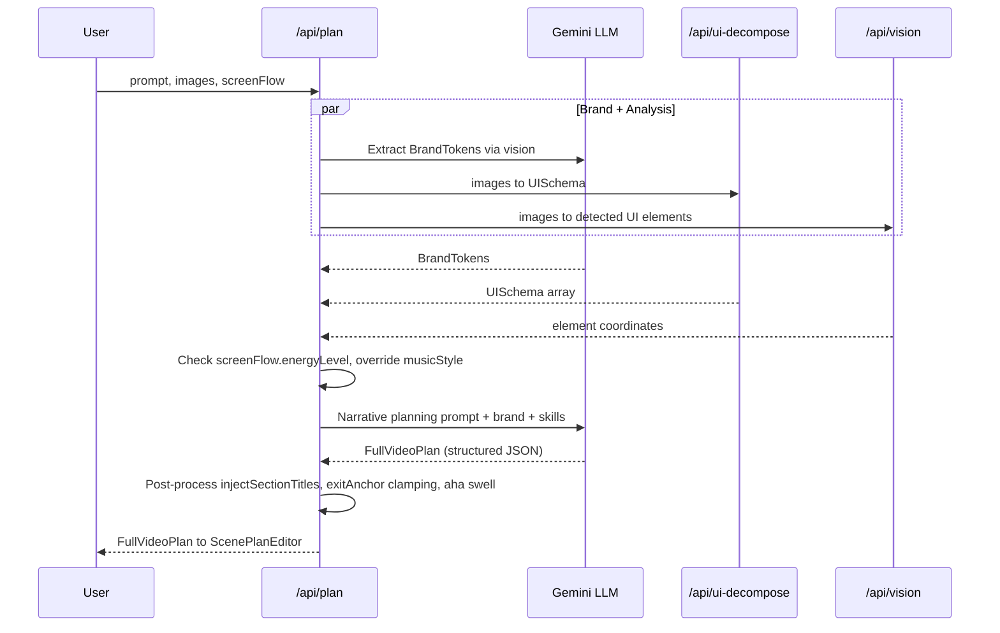

### Key Data Structures

```typescript
FullVideoPlan {
  brand: BrandTokens          // Colors, fonts, style
  scenes: ScenePlan[]          // 6-12 scenes with prompts + skills
  globalVisualThread: string   // Shared visual motif
  globalBg: string             // Background style (arcs/grid/gradient)
  flowEdges: FlowEdge[]        // Scene-to-scene transition graph
  bgSkill?: string             // Background skill override
}

ScenePlan {
  id, title, prompt, skills[]
  durationInFrames              // 60–360 range, 30f grid
  emotionalIntent               // FRUSTRATION | RELIEF | CONFIDENCE | ...
  imageIndex?, imageIndices?    // Screenshot references
  interactionScript?            // Cursor waypoints + timings
  voiceoverText?, wordTimings?  // TTS sync
  transition?                   // fade | slide | cameraPan | zoomThrough | ...
  exitAnchor?, morphExport/Import? // Scene linking
  macroZoom?, stockFootage?     // Cinematic features
  featureHeader?                // Persistent context bar
  uiSchema?                     // Reconstructed UI data
}
```

---

## 5. Data Flow — Generation Phase

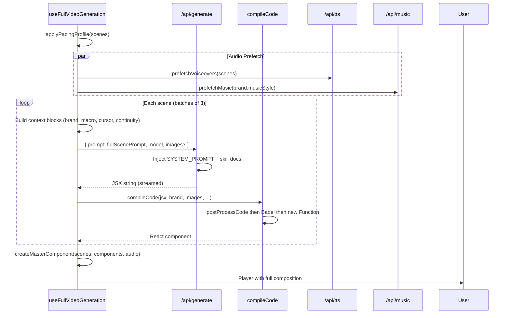

### Scene Code Compilation Pipeline

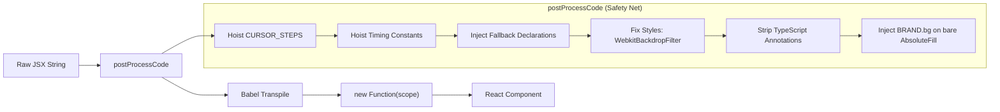

---

## 6. Master Composition — The Infinite Canvas

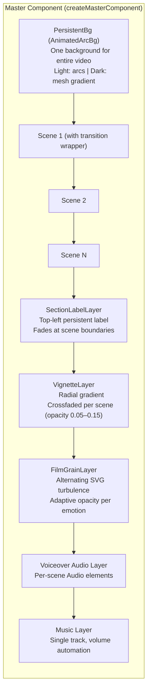

### Timing Model

```
Scene Slot = durationInFrames + HOLD_FRAMES (24f)
Overlap    = TRANSITION_FRAMES (20f)
Total      = Σ(slot) - (N-1) × overlap

Timeline:
|──── Scene 1 ────|──── Scene 2 ────|──── Scene 3 ────|
                   |← 20f overlap →|
                   |← 24f hold ───→|
```

### Transition System (`withTransition`)

| Type | Enter | Exit |
|---|---|---|
| `fade` | opacity 0→1 | opacity 1→0 |
| `slide` | translateX(100%→0) | translateX(0→-100%) |
| `scale` | scale(0.8→1) + opacity | scale(1→0.8) + opacity |
| `cameraPan` | Full-width slide + motion blur (18px→0) | Reverse |
| `zoomThrough` | scale(10→1) ease-out from center | scale(1→10) toward exitAnchor |
| `flash` | White flash + scale(1.05→1) | White flash + scale |

---

## 7. Compiler Scope — Component & Hook Map

### Physics & Motion Hooks
```
useEntropy(strength)          — Deterministic jitter/chaos
useVelocityMomentum(getValue) — Real-time speed/direction
useBeat(bpm?)                 — Musical attack/decay
useBeatClock()                — beat, bar, isDownbeat
useVitality(mode)             — bounce | breathe | float | pulse
useMagnetic(targetX, targetY) — Magnetic snap toward target
useStagger(i, base, step)     — Staggered delay calculation
useCascadeTree(depth, i)      — Hierarchical stagger
useTrackedParallax(depth)     — Depth-based parallax
```

### Camera System
```
CinematicCamera     — Slow push-in zoom + 3D tilt (max 1.06x)
MacroCamera         — Extreme 2–5x zoom, 3-phase (snap → hold → whip)
SteppedCamera       — Keyframed hard-stop camera with whip-pans
ActionCamera        — ONLY camera that tracks cursor at runtime
usePreFocusCamera   — Anticipatory zoom toward upcoming target
```

### Cursor & Interaction
```
useHumanizedCursor  — ±1.5px jitter + breath-pause + click guard
useCursorState      — 3-phase: approach → hover → click
useInteractionCycle — 4-phase: approach → anticipate → act → confirm
useInteractionFeedback — Micro-squish + nudge + glow on click
usePreFocusCamera   — Camera leads cursor to next target
```

### Visual Components (60+)
```
Core:              AbsoluteFill, Img, Audio, OffthreadVideo, spring, interpolate
Glass:             getGlassCard, GlowBloom, ChromaticAberration
Layout:            AppShell, DepthStack, SplitPanel
Text:              MaskedReveal, GarbledText, NarrationReveal, InWorldText
UI Elements:       AnimatedSidebar, AnimatedTable, AnimatedChart, AnimatedForm
                   AnimatedMetricCards, NotificationToast, StatusBadge
Cards:             ContentCard, ChunkCard, NotificationCard
Background:        MeshGradientBg, ArcBg, FloatingShapes, FilmGrain
Cinematic:         MacroCamera, SelectiveFocus, CameraMotionBlur
Path/SVG:          DynamicConnectorLine, usePathTraveler, PaperPlane
                   DrawOnIcon, ICON_PATHS, ConcentricRings
Context:           FeatureContextBar, PersistentSectionLabel
Social:            PersonCard, STOCK_AVATARS, OrbitRing
Chat:              InAppChatPanel
```

---

## 8. Skill System

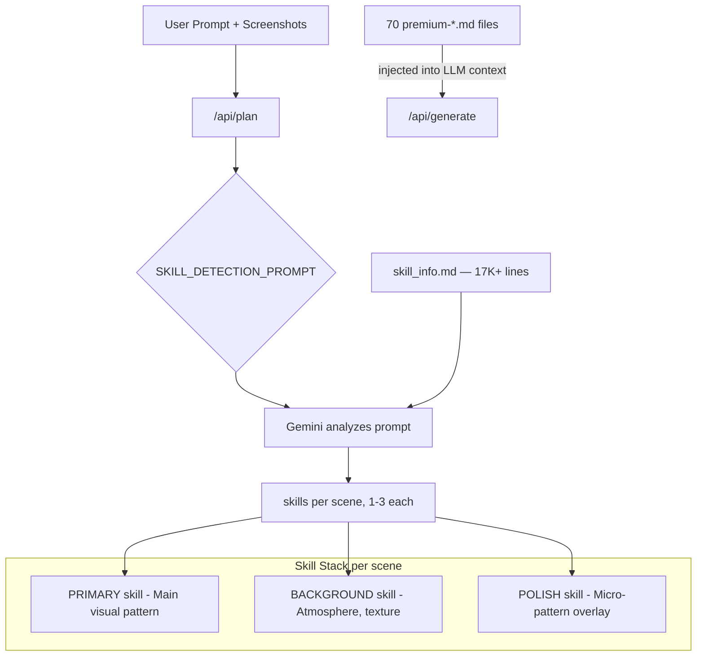

### Skill Categories (70 skills)

| Category | Count | Examples |
|---|---|---|
| UI Interaction | 8 | cursor-engine, chameleon-ui, interactive-ui, app-walkthrough |
| Layout & Composition | 7 | split-screen, feature-grid, before-after, reconstructed-ui |
| Text & Typography | 5 | kinetic-text, char-split, narration-reveal, data-reveal |
| Background & Atmosphere | 8 | ambient-environment, light-arc-bg, dot-matrix-bg, neon-dark |
| Device & Mockup | 4 | 3d-device-mockup, device-mockup, phone-notification |
| Social Proof | 5 | social-proof, testimonial-card, logo-wall, team-orbit |
| Data & Metrics | 4 | stat-counter, metric-flyout, animated-chart, data-flow |
| Camera & Cinematic | 3 | macro-closeup, camera-zoom, 3d-isometric-explode |
| Scene Types | 12 | saas-hook, cta-scene, section-title, icon-arc-reveal |
| Product-Specific | 14 | customer-journey, notification-scatter, in-app-chat, etc. |

---

## 9. Brand Token System

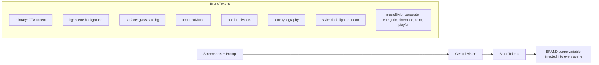

### Music BPM Mapping
| musicStyle | BPM | Character |
|---|---|---|
| corporate | 90 | Steady, professional |
| energetic | 128 | Fast, driving |
| cinematic | 80 | Dramatic, sweeping |
| calm | 68 | Relaxed, ambient |
| playful | 110 | Bouncy, fun |

---

## 10. Narrative Planning — PAS Formula

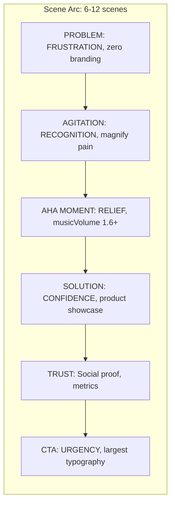

### Emotional Visual Grammar

| emotionalIntent | Damping | Stiffness | Character | Film Grain |
|---|---|---|---|---|
| FRUSTRATION | 150 | 200 | Jittery, uneven | 0.06 |
| PAIN | 300 | 60 | Slow, heavy, dragging | 0.06 |
| RECOGNITION | 200 | 120 | Clean, deliberate | 0.04 |
| RELIEF | 400 | 80 | Floating, weightless | 0.02 |
| CONFIDENCE | 200 | 140 | Synchronized, crisp | 0.03 |
| TRUST | 300 | 100 | Gentle, warm | 0.03 |
| URGENCY | 120 | 180 | Fast, pressing | 0.04 |
| EXCITEMENT | 8 | 200 | Elastic pop, bounce | 0.04 |

---

## 11. Quality Control — Restraint System

### Per-Video Limits (Planner-Enforced)
| Effect | Max | Reason |
|---|---|---|
| MacroCamera zoom scenes | 2 | More = nauseating |
| Major transitions (zoomThrough, cameraPan) | 3 | Each should be an event |
| NarrationReveal | 1 | Overuse dilutes impact |
| Morph portals | 1 | More = gimmicky |
| Notification scatter scenes | 1 | One is impactful |
| Stock footage scenes | 2 | Not a stock footage reel |
| Abstract concept scenes | 2 | Balance with real UI |
| Consecutive same layout topology | 0 | Must alternate |
| Consecutive same transition type | 2 (fade only) | Vary transitions |

### Per-Scene Budget (Generator-Enforced)
| Resource | Max | Reason |
|---|---|---|
| spring() calls | 6 | Competing motion |
| filter: effects | 2 elements | GPU + visual mud |
| useVitality() calls | 3 | Not a screensaver |
| useEntropy() calls | 2 | Controlled chaos only |
| Simultaneous moving elements | 3 | Eye tracks ONE thing |
| useBeat() calls | 2 | Beat on everything = headache |

### Structural Rules
- **Stillness**: 25% of every scene = HOLD (Act 3). Zero movement.
- **Breathing Scenes**: 1 in 4 scenes must be minimal animation (section title, logo, stat).
- **Negative Space**: Every scene needs ≥20% calm area (no moving elements).
- **"Why" Test**: Every animation must answer "what story does this motion tell?"
- **Camera Intentionality**: Every macroZoom needs a reason (focus-detail / guide-attention / reveal-depth / narrative-beat).

---

## 12. Camera-Cursor Coordination

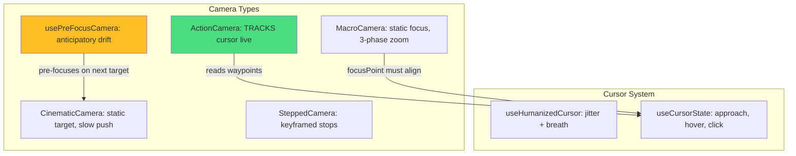

### Sync Rules
1. **Camera leads cursor by 8–15 frames** — usePreFocusCamera creates anticipation
2. **MacroCamera focusPoint ↔ cursor targets must overlap** (within ±0.15)
3. **Camera and cursor must agree on direction** — never pan left while cursor goes right
4. **ActionCamera for cursor-heavy scenes** — only camera that dynamically follows

---

## 13. Audio Architecture

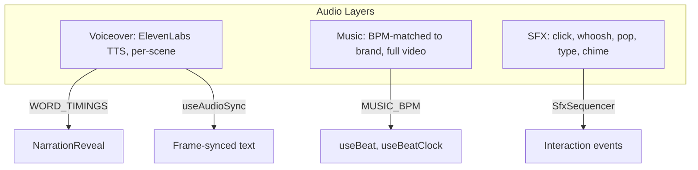

### Audio Pipeline
1. `prefetchVoiceovers()` — Parallel TTS fetch, deduplicated by text hash
2. `prefetchMusic()` — Single fetch, cached by musicStyle
3. Duration alignment: `lastWord.end × 30 + 15f` tail
4. Volume automation: `musicVolume` per scene (0.5 quiet → 1.6 AHA swell)

---

## 14. Rendering Pipeline

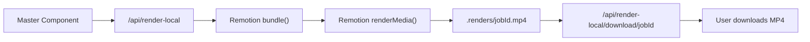

- Output: 1920×1080, 30fps, H.264
- Rendering happens server-side via Remotion's Node.js renderer
- Progress streamed to client during render

---

## 15. Performance Architecture

### Caching
- **Brand Cache**: Module-level singleton keyed by image hash (start50|mid50|end50 sampling)
- **Scene Cache**: LRU (max 30) prevents re-compilation during regeneration/undo
- **Music Cache**: Per-style, one-time generation
- **Voiceover Dedup**: Keyed by text hash

### Compilation Safety
- `postProcessCode()` — Multi-phase structural fixes before Babel
- `safeInterpolate()` — Coerces all outputRange to finite numbers, sorts/dedupes inputRange
- Fallback injection for undefined PascalCase (→ Fragment), camelCase (→ identity fn), UPPER_CASE (→ 0)
- Style auto-fixes: WebkitBackdropFilter pairing, TS annotation stripping

### Batching
- Scene generation: batches of 3 in parallel
- Audio prefetch: all scenes in parallel
- Vision/UIDecomp: parallel with brand extraction

---

## 16. Deployment Notes

- **Runtime**: Node.js (Next.js App Router)
- **Environment Variables**: GOOGLE_GENAI_API_KEY, ELEVENLABS_API_KEY
- **Local Rendering**: Requires Chromium (Remotion dependency)
- **Image Processing**: sharp requires native bindings
- **3D Rendering**: @remotion/three for device mockups (Three.js WebGL)
